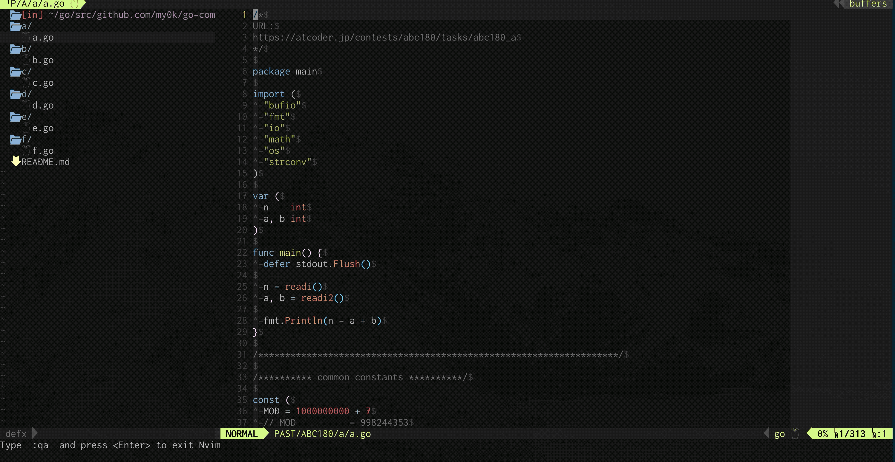
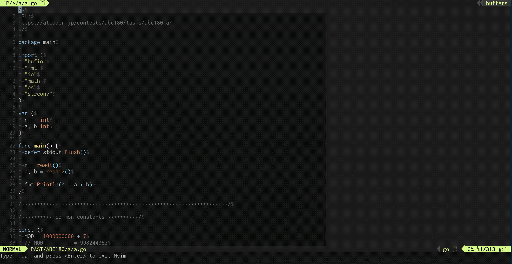

# vim oj(online-judge-tools) helper

[](./LICENSE)

Ex commands for calling `oj`.

## Requirement

- [online-judge-tools/oj](https://github.com/online-judge-tools/oj)

Ex commands are not defined if `oj` is not executable.

## Features

vim-oj-helper provides Ex commands as below.

- Download sample cases of a problem URL, that written in a current buffer.
- Submit a current buffer's file to a problem URL, that written in a current buffer.
- Run a code or a certain executable binary for test cases.

## How to install

You can use your favorite method like using a famous vim plugin managers.

### Using [vim-plug](https://github.com/junegunn/vim-plug)

```vim
Plug 'my0k/vim-oj-helper'
```

## How to use

- Run `:OjDownloadSamples`, then problem samples are downloaded in the same directory with a current buffer file.
  - `oj download -d {{CURRENT BUFFER DIRECTORY}} {{URL}}`
- Run `:OjSubmitCode`, then a current buffer file is submitted to a problem
  - `oj submit -y {{URL}} {{CURRENT BUFFER FILE}}`

**The above two Ex commands assume that a problem URL is written in a current buffer file.**

- Run `:OjExecutableBinTest`, then a executable binary is run for sample cases.
  - `oj test -c "{{CURRENT BUFFER DIRECTORY}}/main" -d {{CURRENT BUFFER DIRECTORY}}/test -t 4`
- Run `:OjLangCommandTest {{LANGUAGE}}`, then a current buffer file is run without compiling for sample cases.
  - `oj test -c "{{LANGUAGE COMMAND}} {{CURRENT BUFFER FILE}}" -d {{CURRENT BUFFER DIRECTORY}}/test -t 4`

### Directory structure example

e.g.: ABC180

```
contests/
  └ ABC180/
    ├ a/
    │  └ a.go
    ├ b/
    ├ c/
    ├ d/
    ├ e/
    └ f/
```

When you open `a.go` in the current buffer, and execute `:OjDownload`, then compile the code,
     you get files like below as a result.

```
contests/
  └ ABC180/
    ├ a/
    │  ├ a.go
    │  ├ main
    │  └ test/
    ├ b/
    ├ c/
    ├ d/
    ├ e/
    └ f/
```

## Options

`:OjSubmitCode` confirms that you submit a code or not before submit.  
You can configure a sentence for each contest site, or omit confirmation by setting empty strings.

```vim
" default
let g:oj_helper_submit_confirms = {
    \'atcoder': 'AtCoder: Are you sure you want to submit?',
    \'codeforces': 'Codeforces: Are you sure you want to submit?',
    \'yukicoder': 'yukicoder: Are you sure you want to submit?',
    \'hackerrank': 'HackerRank: Are you sure you want to submit?',
    \}

" customization
let g:oj_helper_submit_confirms = {
    \'atcoder': '',
    \'codeforces': 'Did you check overflow?',
    \'yukicoder': '',
    \}
```

`:OjExecutableBinTest` needs a executable binary, and you can configure this binary file name.

```vim
" default
let g:oj_helper_executable_binary = 'main'

" customization
let g:oj_helper_executable_binary = 'main.exe'
```

`:OjLangCommandTest` needs a command for running a code without compling,
  and you can configure these commands for each language.  

```vim
" default
let g:oj_helper_lang_commands = {
      \'go': 'go run',
      \'python': 'python3',
      \'javascript': 'node',
      \}
let g:oj_helper_lang_extensions = {
      \'go': 'go',
      \'python': 'py',
      \'javascript': 'js',
      \}

" customization
let g:oj_helper_lang_commands = {
      \'bash': 'bash',
      \}
let g:oj_helper_lang_extensions = {
      \'bash': 'sh',
      \}
```

`:OjDownloadSamples` and `:OjSubmitCode` assume that a problem URL is written in a current buffer file.  
These commands search the URL by a simple regular expression.  
For gaining accuracy, you can configure start and terminal line numbers for searching.

```vim
" default
let g:oj_helper_search_url_s_line = 0
let g:oj_helper_search_url_t_line = 10

" customization
let g:oj_helper_search_url_s_line = 0
let g:oj_helper_search_url_t_line = 5
```

`:OjDownloadSamples` make a directory for downloaded sample cases.  
You can configure any name.

```vim
" default
let g:oj_helper_testcase_dir_name = 'test'

" customization
let g:oj_helper_testcase_dir_name = 'testcases'
```

### Example of `.vimrc`

```vim
if executable('oj')
  let g:oj_helper_submit_confirms = {
        \'atcoder': '',
        \'codeforces': 'Did you check overflow?',
        \'yukicoder': '',
        \}
  let g:oj_helper_executable_binary = 'main.exe'
  let g:oj_helper_lang_commands = {
        \'bash': 'bash',
        \}
  let g:oj_helper_lang_extensions = {
        \'bash': 'sh',
        \}
  let g:oj_helper_search_url_s_line = 0
  let g:oj_helper_search_url_t_line = 5
  let g:oj_helper_testcase_dir_name = 'testcases'

  " alias for your main language
  command! -nargs=0 OjTest :OjLangCommandTest go
endif

```

## Screencast

Download sample test cases (wrapper command of `oj download {{URL}}`).



Run a code for test cases (wrapper command of `oj test -c {{COMMAND}} {{TESTCASES}}`).



Submit a code (wrapper command of `oj submit {{URL}} {{FILE}}`).


